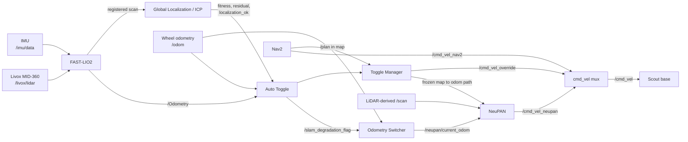
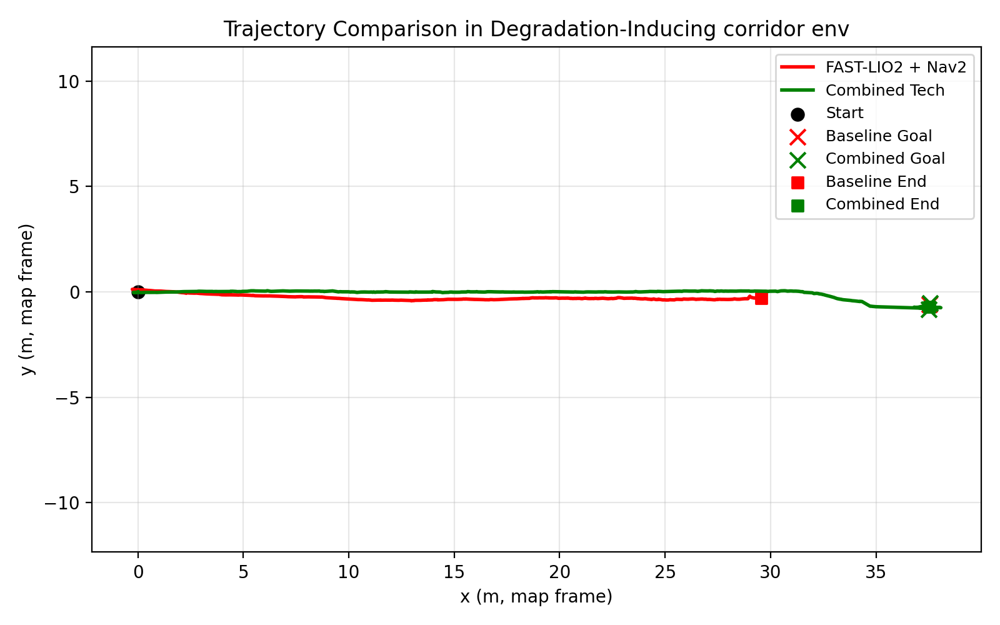
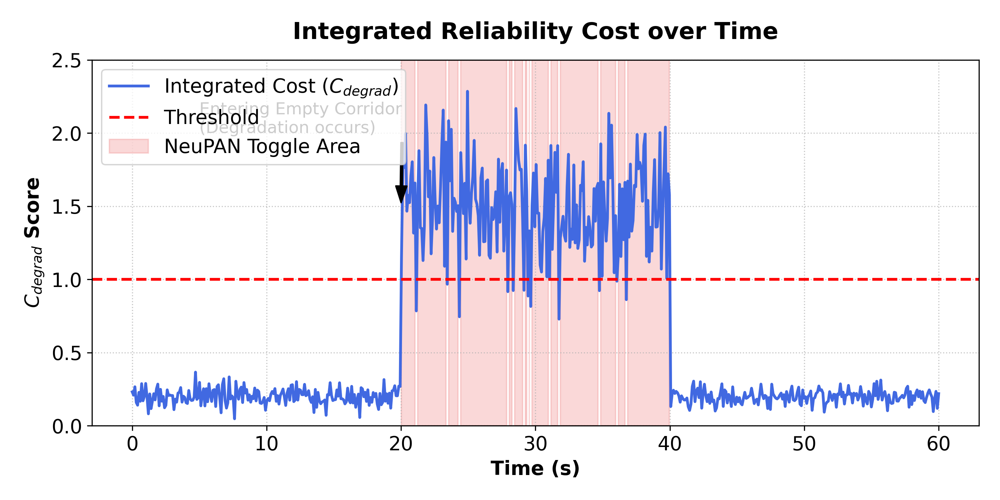
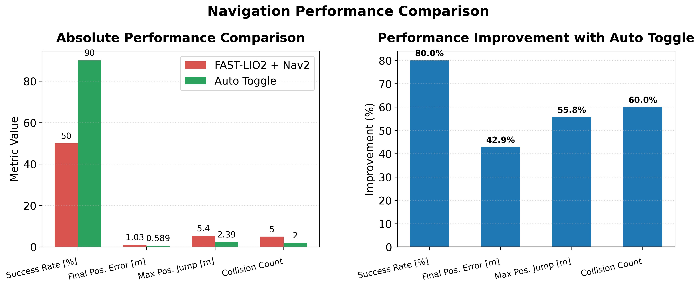

# FAST-LIO2-NeuPAN Navigation System

FAST-LIO2의 정합 상태를 온라인으로 감시하고, 위치 추정이 불안정해지면 Nav2 기반 주행에서 wheel-odometry-referenced NeuPAN 주행으로 자동 전환한 뒤 정합 회복 시 Nav2로 복귀하는 ROS 2 자율주행 시스템입니다.

본 저장소는 **AgileX Scout V2 + Livox MID-360 시뮬레이션**을 대상으로 3D LiDAR-IMU localization, 2D Navigation, 학습 기반 로컬 회피, 연속적인 odometry handoff 및 속도 명령 중재를 하나의 launch로 통합합니다. 특징점이 부족한 넓은 복도에서 발생하는 registration degradation과 위치 점프가 곧바로 주행 실패로 이어지지 않도록 하는 것이 핵심 목표입니다.

> 현재 검증 범위는 Gazebo 시뮬레이션입니다. 실제 Scout 하드웨어 적용 전에는 센서 extrinsic, wheel odometry, footprint, 속도 제한 및 비상정지 체계를 별도로 검증해야 합니다.

## 핵심 기능

- Livox MID-360 PointCloud와 IMU를 사용하는 FAST-LIO2 odometry/localization
- 사전 PCD 지도와 현재 scan의 ICP 정합 및 fitness/localization 상태 발행
- Nav2 global planning 및 costmap 기반 정상 모드 주행
- NeuPAN 기반 degraded-mode 로컬 경로 추종과 장애물 회피
- 정합 잔차, SLAM-wheel 속도 차이, Z drift를 결합한 연속 열화 지표 `C_degrad`
- ICP fitness, localization stability, 지속시간 확인을 포함한 자동 전환 hysteresis
- 전환 순간 pose 연속성을 보존하는 SLAM/wheel odometry offset 정렬
- 열화 진입 시 마지막 정상 `map <-> odom` 변환을 고정하고 Nav2 path를 odom path로 재투영
- Nav2/NeuPAN/정지 override를 단일 `/cmd_vel`로 중재하는 velocity mux
- 회복 정렬 오차 확인 후 Nav2 goal 재전송 및 정상 모드 복귀
- rosbag 기반 trajectory, final position error, maximum position jump 분석 도구

## 시스템 개요



### 주행 모드

| 상태 | 위치 기준 | 경로/제어 | `/cmd_vel_mux/source` |
|---|---|---|---|
| 정상 | FAST-LIO2 + ICP의 `map` frame | Nav2 global path와 controller | `nav2` |
| 정합 열화 | wheel odometry 기반 `odom` frame | 고정된 정상 시점의 path를 odom으로 변환해 NeuPAN이 추종 | `neupan` |
| 도착/전환 보호 | 현재 모드와 무관 | 강제 정지 명령 | `override` |

열화 모드에서 wheel odometry가 별도의 `wheel frame`을 만드는 것은 아닙니다. `odom_switcher`가 전환 직전 출력 자세와 wheel odometry 사이의 SE(2) offset을 계산하여, 출력 frame을 계속 `odom -> base_link`로 유지하면서 위치 불연속을 줄입니다.

## 열화 판단

분석용 통합 지표는 다음과 같습니다.

```text
C_degrad = w_res * (S_res / S_norm)
         + w_vel * (|v_slam - v_wheel| / V_norm)
         + w_z   * (|z_slam - z_baseline| / Z_norm)
```

최종 실험 기본값은 `w_res=0.4`, `w_vel=0.4`, `w_z=0.2`, `S_norm=0.15`, `V_norm=0.5`, `Z_norm=0.25`이며 EMA 계수는 `0.25`입니다. `C_degrad`의 degrade/recover 기준은 각각 `1.0/0.7`입니다.

현재 온라인 전환은 실험에서 복도 구간 분리력이 더 높았던 **ICP fitness를 주 게이트**로 사용합니다. fitness가 `0.35` 미만인 상태가 1.0초 지속되면 degraded mode로 진입하고, `0.39`를 초과하면서 frozen/live localization 정렬 오차가 `0.30 m` 이하인 상태가 1.5초 지속되면 Nav2 복구를 허용합니다. `C_degrad`는 각 오차 성분의 기여도 분석과 시각화를 위해 계속 발행됩니다.

자세한 상태 전이와 토픽은 [아키텍처 문서](docs/ARCHITECTURE.md)를 참고하십시오.

## 실험 결과

동일한 feature-poor wide corridor 환경에서 baseline인 FAST-LIO2 + Nav2와 제안한 auto-toggle 시스템을 각각 10회 비교했습니다.

| 평가 지표 | FAST-LIO2 + Nav2 | Auto-toggle | 개선율 |
|---|---:|---:|---:|
| Success rate | 50.0% | 90.0% | +80.0% |
| Final position error | 1.032 m | 0.589 m | 42.9% 감소 |
| Maximum position jump | 5.399 m | 2.389 m | 55.8% 감소 |
| Collision count | 5 | 2 | 60.0% 감소 |







수치는 저장된 rosbag에서 map-frame planar trajectory의 최종 goal 오차와 연속 sample 간 최대 XY displacement를 추출한 결과입니다. 성공/충돌은 각 trial의 시뮬레이션 관찰 기록을 사용했습니다. 평가 정의와 재생성 방법은 [실험 문서](docs/EXPERIMENTS.md)에 정리되어 있습니다.

## 검증 환경

| 구분 | 구성 |
|---|---|
| OS | Ubuntu 22.04 |
| Middleware | ROS 2 Humble |
| Simulator | Gazebo Classic |
| Mobile base | AgileX Scout V2 model |
| 3D LiDAR | Livox MID-360 simulation |
| State estimation | FAST-LIO2 + global ICP localization |
| Global navigation | Nav2 |
| Degraded-mode controller | NeuPAN |
| Map | PCD prior map + PGM/YAML occupancy map |

## 저장소 구조

```text
FAST-LIO2-NeuPAN-navigation-system/
├── master_IICC.launch.py           # 전체 시스템 통합 launch
├── IICC_rviz_nav2.rviz             # 통합 RViz 설정
├── src/
│   ├── slam_toggle/                # auto-toggle, goal/path handoff, odom switch, cmd mux
│   ├── FAST_LIO_ROS2/              # 3D mapping 기반 패키지
│   ├── FAST_LIO_LOCALIZATION_ROS2/ # FAST-LIO2 + global ICP localization
│   ├── nav2/                       # Nav2 파라미터와 2D map
│   ├── neupan_ros2/                # NeuPAN 및 프로젝트 전용 launch/config
│   ├── base_model/                 # Scout Gazebo model, sensor, worlds
│   ├── scout_description/          # Scout description/meshes
│   ├── ros2_livox_simulation/      # Livox Gazebo sensor plugin
│   ├── livox_ros_driver2/          # Livox ROS 2 message/driver dependency
│   └── pcd2pgm/                    # PCD -> occupancy map 변환
├── pcd/map_lite2.pcd               # localization용 경량 prior map
├── tools/
│   ├── extract_bag_metrics.py      # final error / max jump 추출
│   └── plot_trajectory_from_bags.py
└── docs/
    ├── ARCHITECTURE.md
    ├── SETUP.md
    ├── EXPERIMENTS.md
    ├── TROUBLESHOOTING.md
    └── THIRD_PARTY.md
```

`build/`, `install/`, `log/`, rosbag 원본, 누적 raw PCD 및 IDE cache는 저장소에서 제외합니다.

## 빠른 시작

### 1. 설치와 빌드

```bash
source /opt/ros/humble/setup.bash
git clone https://github.com/jk2001-king/FAST-LIO2-NeuPAN-navigation-system.git ~/IICC_ws
cd ~/IICC_ws

sudo apt update
rosdep update
rosdep install --from-paths src --ignore-src -r -y

colcon build
source install/setup.bash
```

NeuPAN과 global localization에 필요한 Python 패키지는 환경에 따라 추가 설치가 필요합니다. 자세한 내용은 [설치 문서](docs/SETUP.md)를 확인하십시오.

### 2. 전체 시스템 실행

```bash
cd ~/IICC_ws
source /opt/ros/humble/setup.bash
source install/setup.bash
export ROS_DOMAIN_ID=26
ros2 launch master_IICC.launch.py
```

기본값은 다음 최종 실험 구성입니다.

- `enable_hybrid:=true`
- `world_path:=src/base_model/worlds/end_feature_wide_mid.world`
- PCD map: `pcd/map_lite2.pcd`
- 2D map: `src/nav2/2dmap/fastlio_map_2d_2.yaml`

명시적으로 실행하려면:

```bash
ros2 launch master_IICC.launch.py \
  enable_hybrid:=true \
  world_path:=$HOME/IICC_ws/src/base_model/worlds/end_feature_wide_mid.world
```

### 3. 주행

1. RViz와 Gazebo의 초기 위치가 일치하는지 확인합니다.
2. 필요하면 RViz의 **2D Pose Estimate**로 초기 자세를 미세 조정합니다.
3. `/fastlio/icp_fitness`가 발행되고 scan이 prior map과 겹치는지 확인합니다.
4. RViz에서 **Nav2 Goal**을 지정합니다.
5. `/cmd_vel_mux/source`가 `nav2 -> neupan -> nav2`로 전환되는지 관찰합니다.

```bash
ros2 topic echo /cmd_vel_mux/source
ros2 topic echo /slam_degradation_flag
ros2 topic echo /plot/c_degrad
ros2 topic echo /fastlio/icp_fitness
```

baseline은 같은 시스템에서 hybrid만 끄면 됩니다.

```bash
ros2 launch master_IICC.launch.py enable_hybrid:=false
```

## 문서

- [시스템 아키텍처와 자동 전환 로직](docs/ARCHITECTURE.md)
- [환경 설정, 의존성, 빌드 및 실행](docs/SETUP.md)
- [실험 환경, rosbag 기록 및 지표 추출](docs/EXPERIMENTS.md)
- [TF, 위치 점프, costmap, 전환 실패 문제 해결](docs/TROUBLESHOOTING.md)
- [외부 프로젝트와 라이선스](docs/THIRD_PARTY.md)

## 주의사항

- `map_lite2.pcd`와 `fastlio_map_2d_2.pgm/yaml`은 같은 환경과 좌표 기준을 사용해야 합니다.
- `map -> odom`, `odom -> base_link`의 publisher가 중복되면 위치 점프와 TF age 오류가 발생합니다.
- `/initialpose`는 global map과 scan이 충분히 겹치는 위치에서 지정해야 합니다.
- 실험 시 먼저 낮은 속도로 TF, costmap, `/scan`, odometry, 정지 override를 확인하십시오.
- 공개 저장소에 rosbag, 개인정보가 포함된 경로, 장비 IP 또는 비밀키를 커밋하지 마십시오.

## 외부 프로젝트

FAST-LIO2, FAST-LIO localization, NeuPAN, Livox ROS driver/simulation 및 PCD 변환 패키지는 각 원저작자의 프로젝트를 기반으로 수정되었습니다. 각 디렉터리의 원본 README와 LICENSE를 유지하며, 자세한 출처는 [THIRD_PARTY.md](docs/THIRD_PARTY.md)를 따릅니다.
